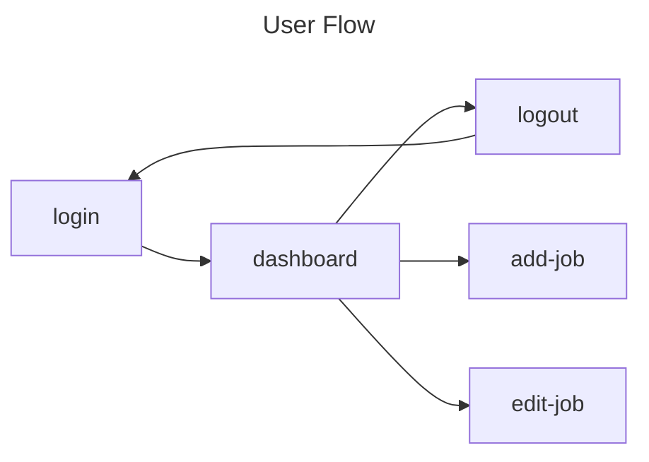
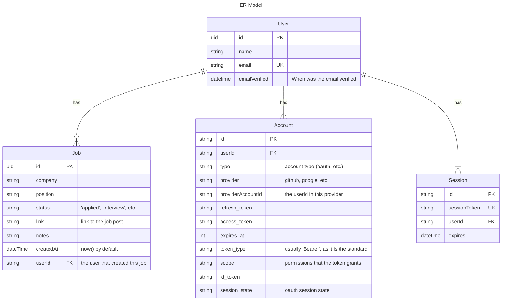

# Documentation

```mermaid
---
title: User Flow
---
graph LR
login --> dashboard --> logout
dashboard --> add-job
dashboard --> edit-job
logout --> login

```

---

```mermaid
---
title: ER Model
---
erDiagram
    User {
        uid id PK
        string name 
        string email UK
        datetime emailVerified "When was the email verified"
    }

    User ||--o{ Job : has
    Job {
        uid id PK
        string company   
        string position  
        string status  "'applied', 'interview', etc."  
        string link "link to the job post"     
        string notes     
        dateTime createdAt "now() by default"
        string userId FK  "the user that created this job" 
    }
    User ||--|{ Account: has

    Account {
        string  id PK             
        string  userId FK        
        string  type "account type (oauth, etc.)"            
        string  provider "github, google, etc."      
        string  providerAccountId "the userId in this provider"
        string refresh_token   
        string access_token      
        int    expires_at       
        string token_type "usually 'Bearer', as it is the standard"    
        string scope "permissions that the token grants"          
        string id_token          
        string session_state "oauth session state"    
    }

    User ||--|{ Session: has
    Session {
        string id PK          
        string sessionToken UK   
        string userId  FK    
        datetime expires         
    } 
```
